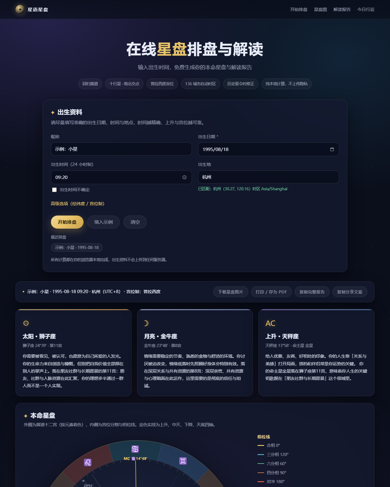
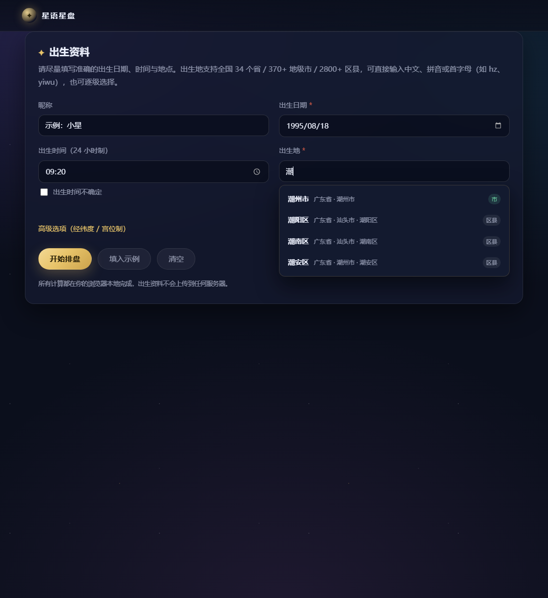
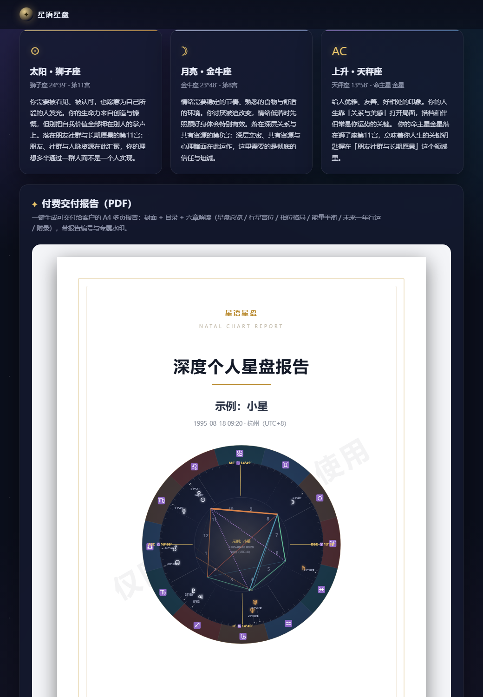
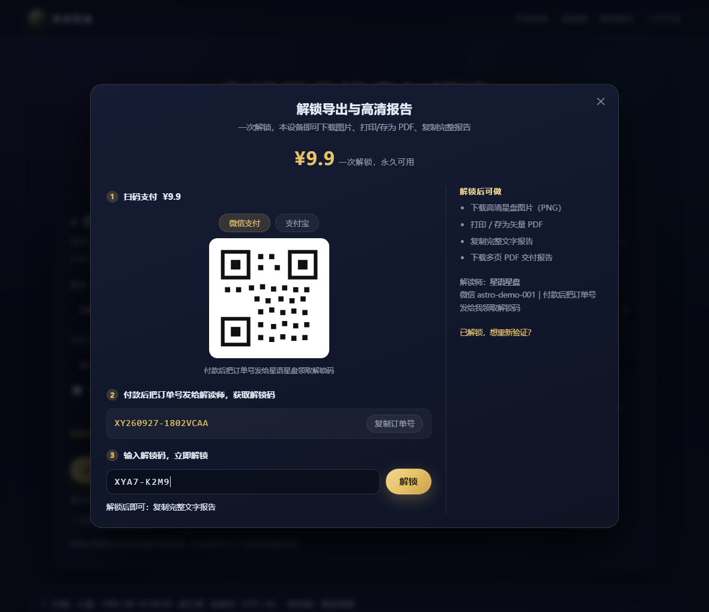
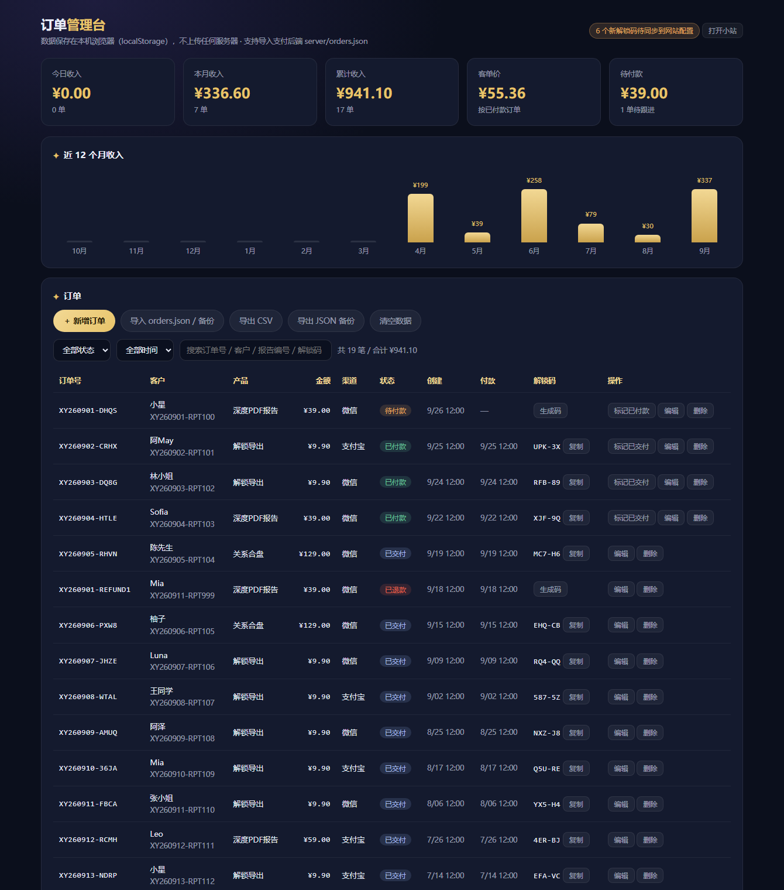
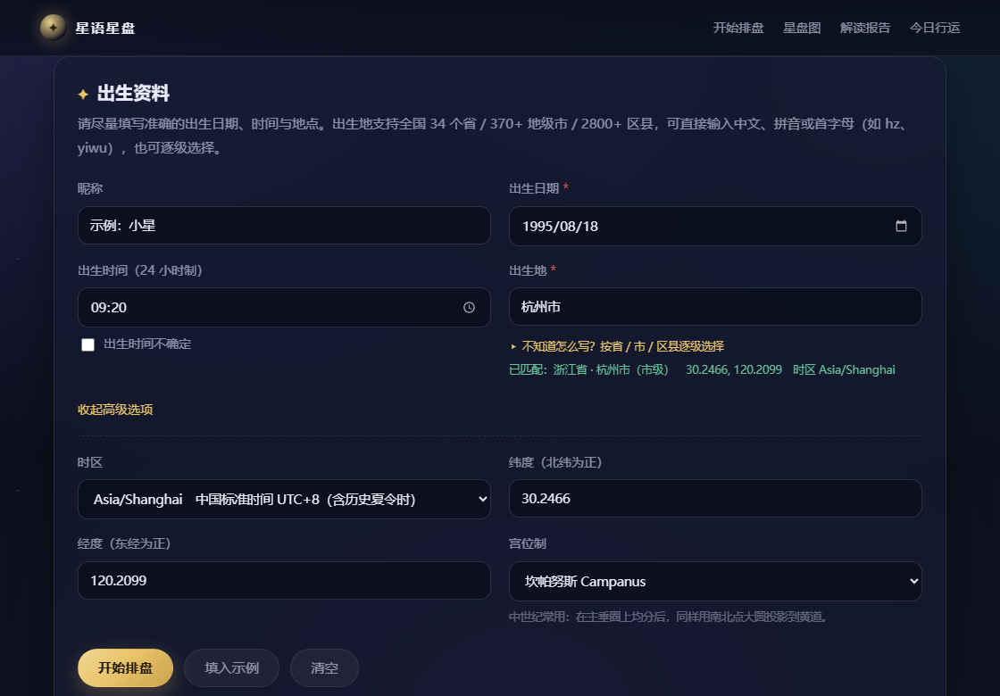

# 星语星盘 · 在线星盘排盘工具

一个**零依赖、纯前端、可离线运行**的占星排盘网站。输入出生日期、时间与地点，自动计算本命星盘、十二宫位、相位格局，并生成中文解读报告。所有计算在浏览器本地完成，出生资料不上传任何服务器。



---

## 一、怎么用

**最简单**：双击目录里的 `启动网站.bat`，或直接双击 `index.html`。

> 本工具不需要联网、不需要安装任何依赖，双击即可运行（计算引擎全部内置）。

如果你想用本地服务器方式（便于手机同局域网访问或部署测试）：

```powershell
cd astro-tool
python -m http.server 8080
# 浏览器打开 http://localhost:8080
```

## 二、功能清单

| 模块 | 说明 |
|---|---|
| 排盘计算 | 太阳、月亮、水星、金星、火星、木星、土星、天王星、海王星、冥王星、南北交点 |
| 四轴 | 上升（ASC）、中天（MC）、下降、天底，精确到分 |
| 宫位制 | **9 种**：普拉西度（默认）/ 波菲里 / 整宫制 / 等宫制 / 魏洛 / 子午线 / 阿尔卡比修斯 / 雷格蒙塔努斯 / 坎帕努斯 |
| 相位 | 合相 / 对冲 / 三分 / 四分 / 六分 / 十二分相 + 次要相位，含容许度、紧密相位、吉凶性质 |
| 格局识别 | 大三角、T 型三角、上帝之指（Yod）、星座群星、宫位群星、星盘形状 |
| 能量分布 | 火土风水元素比例、基本固定变动模式比例、半球分布 |
| 行星状态 | 逆行 ℞、古典庙旺落陷、日行度 |
| 解读报告 | 太阳/月亮/上升深度解读 + 每颗行星落座落宫 + 重要相位 + 格局 + 平衡建议，可展开收起 |
| 行运 | 当前行运星与本命盘的紧密相位（可切换日期） |
| 输出 | 下载星盘 PNG、打印/另存为 PDF、复制完整报告、复制分享文案 |
| 出生地检索 | 全国 34 省 / 370+ 地级市 / 2800+ 区县，支持中文简称、全称、全拼、首字母与省市区三级联动 |
| 付费报告 | 一键生成 A4 多页交付报告（封面/目录/六章/行运节点），带报告编号与专属水印，可导出 PDF 文件 |
| 付费解锁 | 导出功能收费：收款码 + 解锁码（纯前端）或微信/支付宝官方支付（服务端验签）|
| 订单后台 | 订单管理 + 收入统计（今日/本月/累计/客单价、12 个月趋势、产品渠道分布、解锁码管理、CSV/JSON 导出）|'
| 隐私 | 本地计算 + 本地历史记录（localStorage），无后端、无埋点 |

## 三、目录结构

```
astro-tool/
├─ index.html              页面结构
├─ styles.css              样式（深色星空主题 + 打印样式）
├─ 启动网站.bat            双击启动
├─ js/
│  ├─ ephemeris.js         天文计算引擎（行星黄经、恒星时、上升中天、9 种宫位制）
│  ├─ astro.js             星盘组装（星座/宫位/相位/格局/分布/行运）
│  ├─ interpretations.js   解读文案引擎
│  ├─ data.js              70 个国际城市经纬度 + 62 个时区
│  ├─ data-cn.js           全国 34 省 / 372 市 / 2851 区县（含拼音与坐标，自动生成）
│  ├─ place.js             出生地智能检索（简称 / 全拼 / 首字母 / 三级联动）
│  ├─ chart.js             星盘 SVG 绘制（可导出 PNG，渐变 ID 自动唯一）
│  ├─ report.js            付费报告内容模型 + A4 HTML 排版
│  ├─ report-canvas.js     付费报告画布排版（逐页 A4，用于生成 PDF 文件）
│  ├─ pdf.js               内置 PDF 生成器（零依赖，FlateDecode 无损 / JPEG）
│  ├─ pay.js               付费解锁引擎（SHA-256 解锁码 / 授权持久化 / 支付网关）
│  ├─ orders.js            订单与收入统计引擎（站点与后台共用）
│  └─ app.js               页面逻辑 + 【品牌与转化配置 CONFIG】
├─ server/
│  ├─ pay-server.js        支付后端（微信 Native / 支付宝当面付 / 模拟模式）
│  └─ README.md            支付接入与部署说明
├─ tools/
│  ├─ build-cn-data.py     省市区数据编译脚本
│  ├─ unlock-codegen.html  解锁码生成器（给解读师用）
│  └─ order-dashboard.html 订单管理台 + 收入统计（给解读师用，勿部署到公网）
└─ tests/
   ├─ engine-test.js       引擎基准测试（用真实日食月食校验）
   ├─ astro-test.js        星盘与物理自洽性测试
   ├─ house-systems-test.js 宫位制算法校验（对照瑞士星历表 864 组）
   ├─ stress-test.js       1920 组全球纬度压力测试 + 名人星盘交叉验证
   ├─ report-test.js       付费报告模型与排版测试
   └─ pdf-test.js          PDF 结构 / xref / 流校验测试
```

## 四、出生地数据与匹配（全国省市区）

出生地支持 **34 个省级行政区 + 370 多个地级市（含自治州 / 盟 / 地区）+ 2800 多个区县**，四种输入方式都能匹配：

| 输入方式 | 示例 | 说明 |
|---|---|---|
| 中文简称 | `潮州` `伊犁` `阿坝` `浦东` | 自动补全为正式名称（伊犁 → 伊犁哈萨克自治州） |
| 中文全称 | `广东省 潮州市 湘桥区` | 带省份可消解重名（朝阳 → 朝阳市 / 朝阳区） |
| 全拼 | `hangzhou` `yiwu` `neimenggu` | 按拼音匹配 |
| 首字母 | `hz` `bj` `nmg` | 按音节首字母匹配（hz 会列出杭州、湖州、菏泽等） |
| 逐级选择 | 省 → 市 → 区县 | 不确定写法时用下拉三级联动 |

匹配后会自动填入经纬度与该地区时区（港澳台分别使用 Asia/Hong_Kong、Asia/Macau、Asia/Taipei），并在「高级选项」中可随时手工覆盖。

**数据来源**：`js/data-cn.js` 由 `tools/build-cn-data.py` 从 [AreaCity-JsSpider-StatsGov](https://github.com/xiangyuecn/AreaCity-JsSpider-StatsGov)（免费开源的省市区坐标数据，版本 2025.251231）编译生成，含名称、拼音与中心经纬度。为控制仓库体积，原始 160MB 数据未随仓库分发；需要更新时按脚本头部注释重新下载 `ok_geo.csv` 与 `ok_data_level3.csv` 放到 `tools/` 目录，再执行：

```powershell
python tools/build-cn-data.py
```


## 五、改成你自己的品牌（重要）

打开 `js/app.js`，最上方的 `CONFIG` 是全部可配置项：

```js
var CONFIG = {
  siteName: '星语星盘',                                   // 网站名
  slogan: '输入出生时间，免费生成你的本命星盘与解读报告',      // 副标题
  ctaShow: true,                                          // 是否显示引流卡片
  ctaTitle: '想要更深入的个人解读？',
  ctaText: '自动报告只能给出星盘的骨架……',
  ctaBullets: ['一对一深度星盘解读', '关系合盘与情感模式分析', '未来一年行运重点与时间窗口'],
  contactLabel: '微信号',
  contactValue: 'astro-demo-001',                          // ← 改成你的微信号
  qrcodeSrc: '',                                           // ← 填 'images/qr.png' 可显示二维码
  contactTip: '备注「星盘」通过更快，每日前 5 位可获免费简评',
  disclaimer: '本工具的所有计算与内容仅供自我探索……'
};
```

把二维码图片放进 `images/` 目录，再把 `qrcodeSrc` 填成 `'images/qr.png'`，转化卡片就会自动显示二维码。

## 六、付费 PDF 报告（交付给客户用）

排盘后，结果页底部的「付费交付报告（PDF）」卡片可以把免费星盘变成一份可以收费交付的成品报告。



### 报告内容（A4，约 13 页）

| 页 | 内容 |
|---|---|
| 封面 | 品牌署名、报告标题、客户称呼、出生资料、星盘图、报告编号、订单号、出具日期 |
| 目录 | 六章导航 + 出生时间不详时的提示 |
| 01 星盘总览 | 三大主星卡片、本命星盘图、命主星/宫位制/元素模式/星盘形状、行星落点总表 |
| 02 行星落座与宫位 | 十颗行星逐颗解读（落座 + 落宫 + 逆行 + 庙旺落陷）、十二宫位与宫主星表 |
| 03 相位与格局 | 主要相位一览表、重点相位详解、大三角 / T 三角 / Yod / 群星格局 |
| 04 能量平衡与成长建议 | 元素模式半球统计、平衡解读、自动生成的成长建议清单 |
| 05 行运重点 · 未来一年 | 当下行运 + **未来 12 个月的行运节点时间表**（自动扫描 12 个月取最紧密相位） |
| 06 附录 | 计算方法、精度说明、免责声明、报告信息（编号/日期/署名/联系方式） |

### 两种导出方式

| 方式 | 结果 | 适用 |
|---|---|---|
| **下载 PDF 文件** | 直接下载一个 `.pdf` 文件（内置 PDF 生成器，零依赖）。默认用无损 FlateDecode 打包，文字清晰，约 400-500 KB/页 | 直接发微信/邮件交付客户 |
| **打印 / 存为矢量 PDF** | 打开打印面板，目标选「另存为 PDF」 | 需要**文字可选中**、体积更小的矢量版；也方便自己再排版 |

### 可配置项

`js/app.js` 顶部的 `CONFIG.report`：

```js
report: {
  title: '深度个人星盘报告',          // 报告标题
  author: '',                        // 解读师/工作室署名，留空用 siteName
  watermark: '仅限 {client} 使用',    // {client} 自动替换为客户称呼；留空＝无水印
  footer: '本报告仅供个人参考 · 请勿转发',
  pdfQuality: 0.92,                  // 不支持无损压缩时的 JPEG 质量
  lossless: true                     // true = 优先无损打包（文字更清晰）
}
```

报告页面上还能临时填写：客户称呼、订单号、解读师署名、专属水印、联系方式——这些都会写进封面/页脚/附录，方便做**交付留痕**。

### 交付流程建议

1. 客户付款后，在页面填入「客户称呼 + 订单号」，水印建议用「仅限 客户名 使用」或订单号。
2. 点「生成报告预览」核对内容（可展开章节检查）。
3. 点「下载 PDF 文件」得到成品 PDF，直接把文件发给客户。
4. 点「复制交付话术」得到一段包含报告编号与说明的交付文案，连同 PDF 一起发送。
5. 报告编号由出生资料哈希生成，同一张盘编号固定，便于售后核对与防伪归档。

> 说明：报告在浏览器本地生成，因此**无法从技术上阻止客户转发**。实务上建议用水印 + 报告编号做留痕，把「可转发」当成曝光而不是损失——客户转发给朋友时，水印就是你的广告位。
## 七、付费解锁（导出功能收费）

默认开启付费闸门：**免费看解读，导出要付费**。屏幕上的完整解读、行运、格局全部免费阅读（利于引流与平台收录），但下面 5 个动作需要解锁：

| 动作 | 按钮 |
|---|---|
| 下载高清星盘图片 | 「下载星盘图片」 |
| 打印 / 存为 PDF | 「打印 / 存为 PDF」 |
| 复制完整文字报告 | 「复制完整报告」 |
| 下载多页 PDF 交付报告 | 「下载 PDF 文件」 |
| 打印 / 存为矢量 PDF 报告 | 「打印 / 存为矢量 PDF」 |

「复制分享文案」保持免费 —— 那是你的传播入口，客户分享出去自带你的站点链接。



### 两种收款模式

| 模式 | 需要什么 | 适合 |
|---|---|---|
| **A. 收款码 + 解锁码**（默认，纯前端） | 你的微信/支付宝收款码图片 | 个人立刻开卖，零成本 |
| **B. 官方支付接口** | 微信支付商户号 / 支付宝开放平台应用 + 公网 HTTPS 服务器 | 想全自动到账即解锁 |

**模式 A 上线 5 步：**

1. 双击打开 `tools/unlock-codegen.html`（本地运行，不联网）
2. 把 `hashSalt` 改成自己的值 → 生成 20 个解锁码，保存明文列表
3. 复制的「哈希数组」粘贴到 `js/app.js` 的 `CONFIG.pay.unlockHashes`
4. `CONFIG.pay.hashSalt` 改成同一个值，并把 `demoCode` 改为 `''`（删掉演示码）
5. 收款码图片放进 `images/`，填 `wechatQrcode` / `alipayQrcode`

客户流程：点付费导出 → 扫码付款 → 把订单号发给你 → 你发一个解锁码 → 客户输入后立即解锁（本设备永久有效）。

**模式 B 上线：** 见 `server/README.md`，已实现微信 Native 扫码支付（APIv3 验签 + AES-GCM 解密回调）与支付宝当面付（RSA2 验签），前端填 `apiBase` 并打开 `apiEnabled` 后自动切换为「支付成功自动解锁」。

### 配置项

```js
pay: {
  enabled: true,                 // false = 全部免费
  mode: 'tool',                  // tool 一次解锁本设备 | report 每份报告单独解锁 | both 两种码都认
  price: 9.9,
  priceText: '¥9.9',
  hashSalt: '改成你自己的盐',      // 必须与 tools/unlock-codegen.html 里一致
  unlockHashes: [],              // 通用解锁码哈希
  reportHashes: [],              // 报告级解锁码哈希（mode=report/both 时用）
  demoCode: '',                  // 上线前务必置空（默认 DEMO-8888 仅用于体验流程）
  wechatQrcode: 'images/wechat-qr.png',
  alipayQrcode: '',
  contact: '微信 your-wechat｜付款后发订单号领取解锁码',
  apiBase: '',                   // 官方支付后端地址
  apiEnabled: false
}
```

### 关于安全（重要）

- 纯前端校验（模式 A）**只能提高门槛，不能杜绝破解** —— 懂技术的人可以改 JS 绕过。所以源码里只保存解锁码的 SHA-256 哈希，无法反推出码；但「是否解锁」这个判断发生在浏览器里，本质上可被绕过。
- 真正防盗版必须服务端验签（模式 B）：支付结果由微信/支付宝回调、服务端验签后写入订单状态，前端只是查询。本项目的 `server/pay-server.js` 已经按这套流程实现。
- 实务建议：**水印 + 报告编号**做留痕（已内置），把客户转发当作曝光；单量小用模式 A，稳定后升级模式 B。

### 定价参考

| 产品 | 建议价 | 说明 |
|---|---|---|
| 解锁本设备导出 | ¥9.9 ~ ¥19.9 | 转化率高，适合引流后第一次成交 |
| 单份深度 PDF 报告 | ¥39 ~ ¥99 | 报告本身有价值，用 `mode: 'report'` |
| 月度陪跑 / 年度推运 | ¥199+ | 人工服务，用报告 + 微信交付 |
## 八、订单管理台与收入统计

双击 `tools/order-dashboard.html` 打开（**只在本机使用，不要部署到公网**）。数据存在浏览器 localStorage，不上传任何服务器；也支持导入支付后端的 `server/orders.json`。



### 收入概览

| 指标 | 说明 |
|---|---|
| 今日 / 本月 / 累计收入 | 只统计「已付款 + 已交付」的订单 |
| 客单价 | 累计收入 ÷ 付费订单数 |
| 待付款 | 有待跟进（客户点了付费导出但还没付款）的金额与单数 |
| 近 12 个月柱状图 | 每月收入趋势 |
| 产品 / 渠道 / 状态分布 | 哪个产品赚钱、微信还是支付宝多、多少单待交付 |

### 订单表能做什么

- **自动记账**：客户在小站点「付费导出」时，网站自动写入一笔待付款订单（同一报告 30 分钟内不重复建单，防止刷单）
- **自动转已付款**：客户输入解锁码成功后，订单自动标记为已付款，并记下他用的解锁码
- **批量生成解锁码**：点「生成解锁码」批量出码，或对单笔订单点「生成码」直接发码（自动复制）
- **同步提示**：新生成的哈希没写进 `CONFIG.pay.unlockHashes` 时，右上角会提示「N 个新解锁码待同步」，点「复制哈希数组」粘过去即可
- **人工记账**：线下收款也能「＋ 新增订单」（客户、产品、金额、渠道、状态）
- **筛选搜索**：按状态、时间范围（今天/7 天/本月/90 天）、订单号 / 客户 / 报告编号 / 解锁码搜索
- **导出**：CSV（给财务或 Excel）、JSON 备份（换电脑时导入即可迁移）
- **导入**：支持导入支付后端 `server/orders.json`（自动把 `subject` 映射为产品、`paid` 映射为已付款）

### 数据怎么流转（三种场景）

| 场景 | 客户付款数据从哪来 |
|---|---|
| 本地自用（file:// 打开小站 + 后台） | 同一个浏览器 profile 下 localStorage 共享，后台直接读到 ✓ |
| 站点已上线 + 用官方支付 | 站点会把订单事件同步到后端（`/api/track`），后台导入 `server/orders.json` |
| 站点已上线 + 用收款码 | 后台「＋ 新增订单」手工记账，或从「待付款」列表里点「标记已付款」 |

> 提示：订单数据只在这台电脑的这个浏览器里。建议每周点一次「导出 JSON 备份」存到网盘。
## 九、部署到 GitHub Pages

### 0. 先搞清楚哪些文件会公开

`.github/workflows/pages.yml` 只把**公开站点文件**发布到 Pages：

```
index.html   styles.css   js/   images/   .nojekyll
```

**以下永远不会出现在公开站点**（工作流里有硬校验，一旦发现被发布就构建失败）：

| 目录 | 内容 | 为什么不能公开 |
|---|---|---|
| `tools/` | 订单管理台、解锁码生成器 | 无登录保护，会把订单与解锁码暴露出去 |
| `server/` | 微信/支付宝支付后端 | 含商户密钥等敏感配置 |
| `tests/` | 测试脚本 | 无需公开 |

### 1. 上线前必做 3 件事

| # | 事项 | 怎么改 |
|---|---|---|
| 1 | **删掉演示解锁码** | `js/app.js` → `CONFIG.pay.demoCode: ''`（公网环境下演示码已自动失效，双保险） |
| 2 | **配上真正的解锁码** | 打开 `tools/order-dashboard.html` 或 `tools/unlock-codegen.html` → 生成解锁码 → 把哈希数组粘到 `CONFIG.pay.unlockHashes`。**不做这步客户付了款也解不了锁** |
| 3 | **配收款码** | 微信收钱码另存为 `images/wechat-pay.png`，填到 `CONFIG.pay.wechatQrcode`（支付宝同理填 `alipayQrcode`） |

> 没配收款码时，付费窗会自动退回显示 `CONFIG.qrcodeSrc`（也就是你已经放好的加好友二维码），提示语变成「扫码加微信 → 转账 → 把订单号发给我领取解锁码」，这条路径同样可以正常收钱。

改完先本地验证一遍发布内容：

```powershell
powershell -ExecutionPolicy Bypass -File tools\build-site.ps1
# 它会组装 _site 目录、列出将要公开的每个文件，并提醒你还差哪些配置
# 双击 _site\index.html 可以先看效果
```

### 2. 推送到 GitHub（一条命令）

```powershell
# 第 1 步：先在 https://github.com/new 建一个空仓库（不要勾 README / .gitignore）
#         建议仓库名：astro-tool

# 第 2 步：在项目上一级目录运行（脚本会自动组装校验 + 提交 + 推送）
cd C:\Users\whlqb\Documents\ChatGPT\工作
powershell -ExecutionPolicy Bypass -File astro-tool\tools\deploy-github-pages.ps1 `
  -RemoteUrl https://github.com/<你的用户名>/astro-tool.git
```

脚本会：组装并校验发布内容 → 检查/初始化 Git → 校验提交身份（缺了就提示你输入）→ 提交 → 配置远程 → 推送。

也可以手动执行：

```bash
git add -A
git commit -m "部署：星盘工具上线"
git branch -M main
git remote add origin https://github.com/<你的用户名>/astro-tool.git
git push -u origin main
```

### 3. 打开 Pages

推上去之后：

1. 打开仓库 → **Settings** → 左侧 **Pages**
2. **Source** 选 **GitHub Actions**（不要选 Deploy from a branch）
3. 回到 **Actions** 标签页，能看到 `Deploy to GitHub Pages` 正在跑（约 1 分钟）
4. 跑完后访问：`https://<你的用户名>.github.io/<仓库名>/`

首次访问建议自测：填一个出生时间排盘 → 点「复制完整报告」→ 付费窗应弹出、能看到你的二维码 → 用（本地才有用的）演示码验证流程 → 正式上线后用自己的解锁码验证一次。

### 4. 后续更新

以后改完代码，只要 `git push`，GitHub Actions 会自动重新构建发布，不需要手动上传任何文件。

### 5. 自定义域名（可选）

1. 仓库 **Settings → Pages → Custom domain** 填你的域名
2. 到域名商处加一条 CNAME 解析指向 `<你的用户名>.github.io`
3. 勾选 **Enforce HTTPS**
4. 如果想让工作流自动写入域名，可在构建步骤里加一行 `echo "你的域名" > _site/CNAME`

### 6. 部署后的订单怎么记账（重要）

线上站点的 localStorage 属于 `https://<你的用户名>.github.io`，**本地后台（file:// 打开）读不到它**。三种做法：

| 场景 | 做法 |
|---|---|
| 上了支付后端 | 站点会把订单事件推到 `/api/track`，后台「导入 orders.json」即可汇总全部订单 |
| 只用收款码 | 客户付款后你在后台「＋ 新增订单」手工记一笔（或从待付款列表点「标记已付款」） |
| 只在自己电脑上用 | 站点与后台都用 file:// 打开，localStorage 共享，后台直接就能看到 |

### 7. 不想用 GitHub Pages？其他托管方式

`tools\build-site.ps1` 产出的 `_site` 目录可以原样上传到任何静态托管：

- **Vercel / Netlify**：拖拽 `_site` 文件夹即可（无需构建命令）
- **国内**：阿里云 OSS / 腾讯云 COS 静态网站托管、宝塔面板、任意 Nginx 目录
- 注意：国内托管若绑定域名需备案；且**不要把 `tools/` 一起传上去**

Nginx 参考配置：

```nginx
server {
  listen 80;
  server_name your-domain.com;
  root /var/www/astro-tool/_site;
  index index.html;
  location / { try_files $uri $uri/ /index.html; }
}
```
## 十、配合引流使用的建议

1. **免费排盘作为引流品**：用户看到「太阳/月亮/上升」的免费解读后，正好处在好奇心最强的时刻，此时 `CTA` 卡片出现，转化率最高。
2. **分享文案自带logo与链接**：结果页的「复制分享文案」会带上你的站点地址，用户发到群或小红书时自动引流。
3. **评论区/主页导流**：把站点链接放在小红书、抖音、公众号菜单、视频简介里，比文字话术更容易被平台接受。
4. **承接私域**：免费报告只给骨架，深度解读（感情、事业、行运）留到私域成交，这就是天然的漏斗。
5. **下沉变体**：想验证选题，可以只改 `CONFIG` 里的文案和 `style` 主色，做成多个不同定位的落地页。

## 十一、宫位制（9 种，全部经过权威校验）

同一个出生时刻，不同宫位制会给出不同的宫位划分——这是**流派定义差异**，不是精度差异。本站把主流系统都做了，并在下拉框里实时显示每个系统的说明。

| 宫位制 | 分组 | 说明 |
|---|---|---|
| **普拉西度 Placidus** | 常用（现代） | 现代最常用，按时间三等分昼夜弧；Astro.com 默认 |
| **波菲里 Porphyry** | 常用（现代） | 古典方法，把「上升—中天」象限直接三等分；极区最稳 |
| **整宫制 Whole Sign** | 等宫与整宫 | 一个星座就是一宫，自上升所在星座起算；古典希腊与印度占星常用 |
| **等宫制 Equal** | 等宫与整宫 | 自上升点起每 30° 一宫，与星座边界无关 |
| **魏洛 Vehlow** | 等宫与整宫 | 等宫制变体，整体后退 15°，使上升点落在第一宫正中 |
| **子午线 Meridian** | 赤经分割 | 按赤经自东点起每 30° 均分再投影到黄道 |
| **阿尔卡比修斯 Alcabitius** | 赤经分割 | 古典：在赤经上三等分「中天—上升」与「上升—天底」 |
| **雷格蒙塔努斯 Regiomontanus** | 古典投影 | 文艺复兴常用：赤道均分后，用穿过地平圈南北点的大圆投影到黄道 |
| **坎帕努斯 Campanus** | 古典投影 | 中世纪常用：在主垂圈上均分后同样投影到黄道 |

### 怎么保证算得对

宫位制的公式很容易写错（差一点点就会让整盘宫位偏移），所以本站的做法是**跟权威实现逐宫头对比**：

1. `tools/gen-house-reference.py` 用 **瑞士星历表 Swiss Ephemeris**（Astro.com 同一套内核）生成基准数据
2. 对比时传入**完全相同的「中天赤经 + 黄赤交角」**，把时间模型的差异排除掉，只检验宫位算法本身
3. 每组都覆盖 8 个纬度（含赤道、南半球、极区）× 12 个中天赤经 = **96 组/系统**

实测结果（`node tests/house-systems-test.js`）：

```
普拉西度 Placidus        96 组  最大误差 0.00000°
波菲里 Porphyry         96 组  最大误差 0.00000°
整宫制 Whole Sign        96 组  最大误差 0.00000°
等宫制 Equal            96 组  最大误差 0.00000°
魏洛 Vehlow             96 组  最大误差 0.00000°
子午线 Meridian          96 组  最大误差 0.00000°
阿尔卡比修斯 Alcabitius    96 组  最大误差 0.00000°
雷格蒙塔努斯 Regiomontanus  96 组  最大误差 0.00000°
坎帕努斯 Campanus         96 组  最大误差 0.00000°
```

另外还有结构自洽性校验：宫头顺序递增、对宫严格相差 180°、象限类宫位制的一宫头 = 上升、十宫头 = 中天；南半球与极区不崩溃，普拉西度在极昼极夜无解时自动降级为波菲里并提示。

> 没有收录的系统：科赫 Koch、地形 Topocentric、摩里努斯 Morinus、地平 Horizontal、克鲁辛斯基 Krusinski。这些系统的公式我还没能校验到亚角秒级——**宁可不提供，也不上线算不准的宫位制**。


## 十二、计算精度与免责

- 采用**回归黄道**（Tropical）与当日真黄经，历元为当日平春分点。
- 精度：太阳、月亮约 1 弧分；内行星 1-2 弧分；外行星 1-10 弧分；适用 1800 - 2100 年。
- 校验方式：用 2026 年真实日月食时刻（新月/满月）反算日月距角误差均 < 0.1°；用日出时刻反算上升点，误差 < 0.001°。
- 时区支持历史夏令时（含中国 1986-1991 年夏令时、欧美 DST）。
- 高纬度地区（极昼极夜导致普拉西度无解）会自动降级为波菲里宫位制，并在页面上提示。
- 本工具内容仅供自我探索与娱乐参考，不构成医疗、法律、投资、婚姻等专业建议。

## 十三、运行测试

```powershell
cd astro-tool
node tests/engine-test.js      # 天文引擎基准（日月食、节气、逆行）
node tests/astro-test.js       # 星盘组装、相位判定、日出几何自洽
node tests/house-systems-test.js # 9 种宫位制 vs 瑞士星历表逐宫头校验
node tests/stress-test.js      # 全球纬度压力测试 + 公开名人星盘交叉验证
node tests/report-test.js      # 付费报告模型、章节完整性、水印与转义
node tests/pdf-test.js         # PDF 结构、xref 交叉引用、Flate 流校验
node tests/place-test.js      # 出生地检索：简称、全拼、首字母、重名消歧
node tests/cn-data-test.js    # 全国省市区数据完整性
node tests/pay-test.js        # 付费解锁引擎（含 SHA-256 标准向量校验）
node tests/pay-server-test.js # 支付后端（模拟模式，无需商户号）
node tests/orders-test.js     # 订单与收入统计
```

## 十四、可以继续扩展的方向

- 合盘（Synastry）与组合盘（Composite）
- 次限推运 / 太阳弧推运 / 法达星限
- 报告模板自定义（配色 / 章节开关 / 附加手写寄语）
- 用户账号 + 云端保存星盘
- 多语言（英文版直接面向 TikTok / YouTube 海外受众，客单价更高）

（当前版本：1.5 · 前端零依赖 · 计算 / 出生地检索 / 报告生成 / 付费解锁 全部本地完成，支付可选服务端）